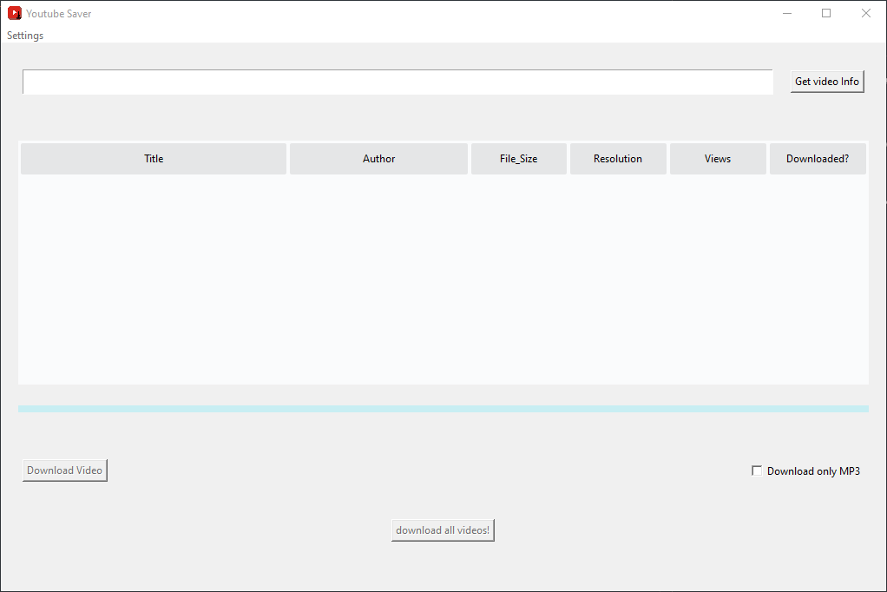
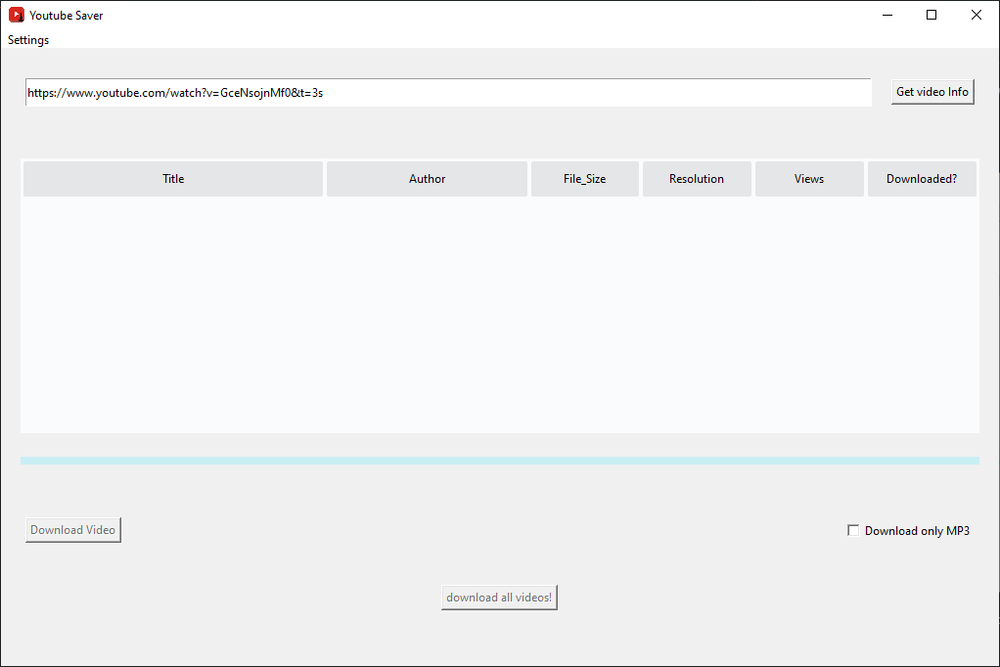
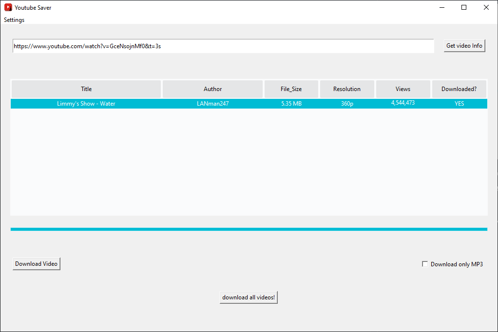
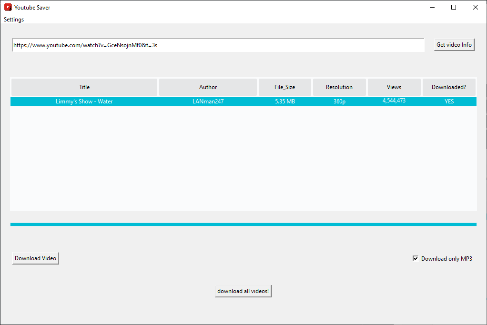

# Youtube Saver

A Simple Youtube Downloader _for the public_

## Usage

Just execute the .exe file

Paste the URL from the Youtube Video you want to download and press the "Get video Info" Button

Wait for the video to Load, then pick it from the list and press the "Download Video" Button

**_the bar on the bottom will start to fill up_**

**_when it reaches the end the video has been downloaded and the "Downloaded?" Column will be updated_**

## Extra Steps

You can download the audio only from a video by checking the "Download only MP3" checkbox

You can Load a full playlist by just pasting the playlist link and pressing the "Get video Info" Button

You can also download every Loaded video by clicking the "Download all videos!" Button

## Be carefull

This Program is for Windows ONLY
