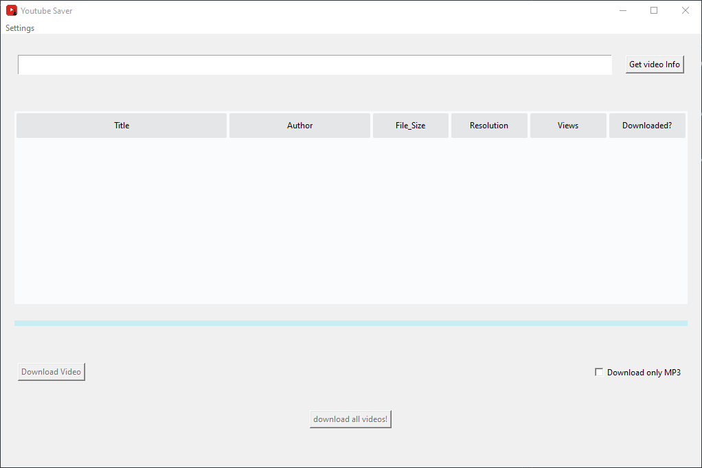

# YouTube Video Saver - Desktop Application



YouTube Video Saver is a desktop application that allows you to download YouTube videos and entire playlists as MP4 or MP3 files. Built with Python, it provides a simple GUI interface with progress tracking, error handling, and customizable download settings.

## Features

- Single Video Download
  - Download any YouTube video (as MP4 or MP3)
  - Shows video details (title, resolution, file size, views)
  - Progress bar during download
- Playlist Support
  - Download entire playlists with a single click
  - Automatic detection of playlist URLs
- Smart Error Handling
  - Graceful error messages for private videos, region blocks, and unavailable content
  - Prevents duplicate downloads
- Customizable Download
  - Set default download folder via settings
  - MP3 toggle for audio-only downloads
  - Download history tracking
- User-Friendly Interface
  - Clean, modern design with status indicators
  - Error messages in red for visibility
  - Multi-threaded downloads for better performance

## Installation

1. Prerequisites:
   - Python 3.7+ (including pip)
   - Tkinter (usually included with Python)
   - `pytube` library
   - `requests` library
2. Install Dependencies:
   - `pip install pytube requests`
3. Run the Application:
   - `python yt_saver.py`

## Usage Guide

1. Setting Download Folder
   - First run will prompt you to set your default download folder
   - Can be changed later via menu: `File > Change Download Folder`
2. Downloading a Single Video
   1. Enter a valid YouTube URL in the input field
   2. Click Download Video button
   3. Toggle "Download only MP3" if needed
   4. Progress bar shows download status
   5. Completed downloads are marked "YES" in the status column
3. Downloading a Playlist
   1. Paste a YouTube playlist URL
   2. Click Download All Videos!
   3. All videos in the playlist will download sequentially
4. Managing Downloads
   - View Errors: Red error messages appear if issues occur
   - Download History: Previously downloaded videos are shown in the list
   - MP3 Conversion: When toggled, videos download as MP3 audio only

## Configuration

The application stores settings in `settings.json`:

```json
{
  "download_folder": "/path/to/downloads"
}
```

You can manually edit this file to change your download location at any time.

## Requirements

- Python 3.7+
- Tkinter
- pytube library
- requests library
- Windows with desktop environment

## Contributing

Contributions are welcome! Please follow these steps:

1. Fork the repository
2. Create a feature branch (git checkout -b feature/awesome-feature)
3. Commit your changes (git commit -m 'Add some feature')
4. Push to the branch (git push origin feature/awesome-feature)
5. Open a pull request

## License

This project is licensed under the MIT License - see the [LICENSE file](LISENSE.txt) file for details.

---

_Note: This application only downloads videos from YouTube that are publicly available. Downloading copyrighted content without permission may violate YouTube's Terms of Service and local laws. Always respect copyright and YouTube's terms._
